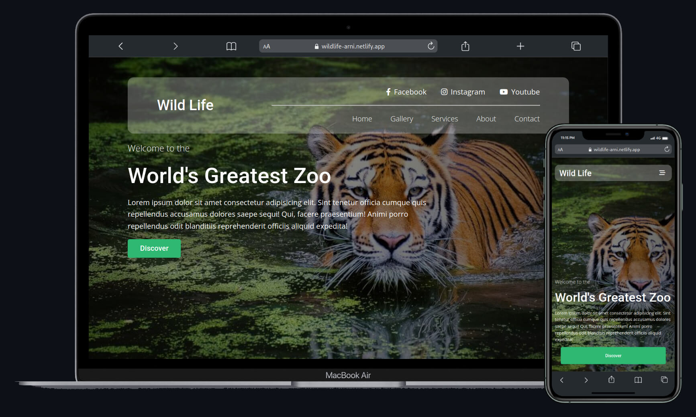

## WildLife

[View Design](https://www.figma.com/file/b02VexaDObVTnaAklLccM7/Wild-Life?node-id=0%3A1)

1. Descargar el proyecto y abrir una terminal con la ruta del mismo.
2. Ejecutar el comando npm install
3. Si se quiere modificar los estilos css o el archivo js se debe modificar los archivos que se encuentran dentro de la carpeta src/ para su correcta compilación se debe ejecutar el comando **gulp**

